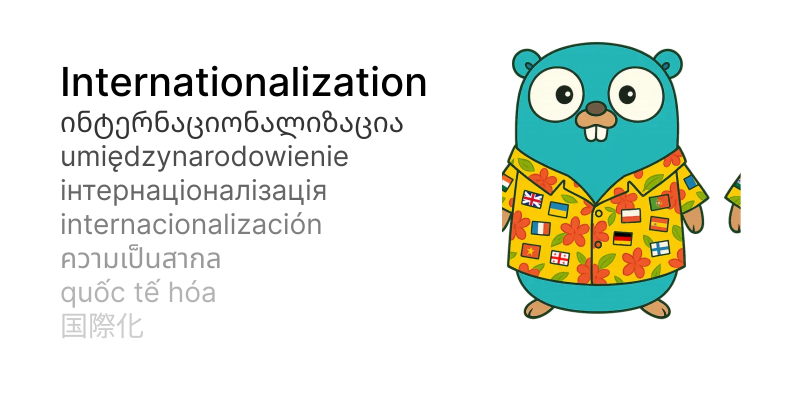

# localize



Workflow:

1. Define the default texts in your code.
2. Generate translation GNU texttext `.po` and `.pot` files from your source code.
3. Translate locale template files (manually or using AI).
4. Generate `.go` bundles from translated locale files.
5. During app initialization, enable the bundles you need.

## Example Workflow

1. Define the default texts in your code:

```go
package main

func main() {
	// Get English localization (which is the default in this example).
	localization, err := localize.New(language.English,
		/* once you generated the localized readers you'll add them here */)
	if err != nil {
		panic(err)
	}

	// Get the best matching localized reader for English.
	l := localization.Match(language.English)

	fmt.Println(
		// Politely asking for the user's mood.
		l.Text("How are you today?"),
	)

	messagesUnread, messagesProcessing := 4, 10

	// Number of unread messages the user currently has.
	l.Plural(localize.Forms{
		One: "You have %d unread message",
		Other: "You have %d unread messages",
	}, messagesUnread)

	// Number of messages that are currently being processed.
	l.PluralBlock(localize.Forms{
		One: `
			%d message is currently being processed.
			Please keep calm and continue internationalizing.
		`,
		Other: `
			%d messages are currently being processed.
			Please keep calm and continue internationalizing.
		`,
	}, messagesProcessing)
}
```

2. Scan your code base to generate the `.po` file and as `.pot` files for translation:

```sh
go run github.com/romshark/localize/cmd/localize generate -l en -t de -t fr
```

This will generate:

- `locale.en.po` file containing the original English translation from the source code.
- `locale.de.pot` template file for German translations.
- `locale.fr.pot` template file for French translations.

3. Translate your
